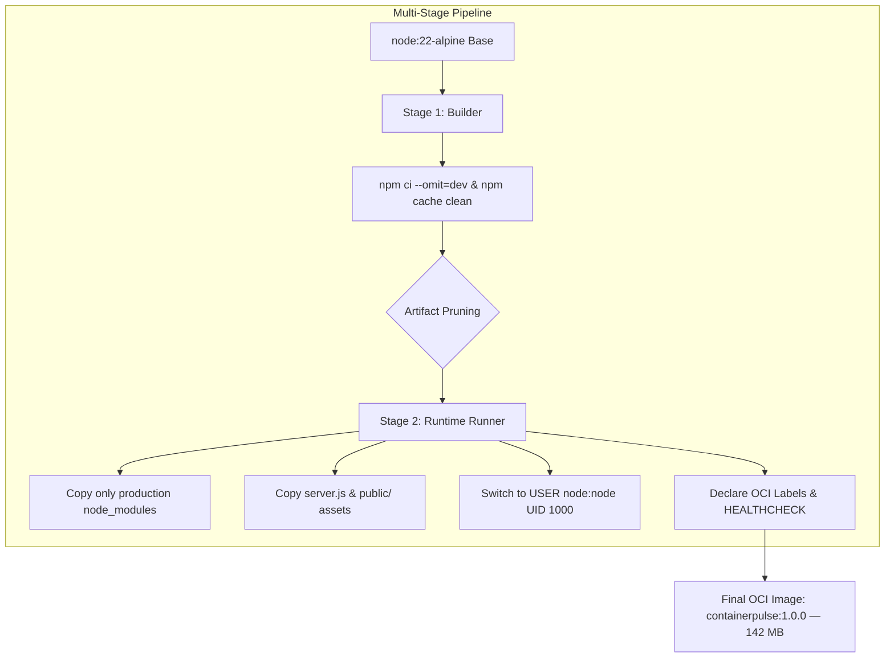

# ContainerPulse — Cloud-Native OCI Container Engineering, Optimization & Security

[-10b981?style=flat&logo=docker&logoColor=white)](https://github.com/Achindra2003/devops-lab3-oci-containers)
[-blue?style=flat&logo=securityscorecard)](https://github.com/Achindra2003/devops-lab3-oci-containers)
[](https://github.com/Achindra2003/devops-lab3-oci-containers)
[](https://opencontainers.org)
[](https://github.com/Achindra2003/devops-lab3-oci-containers)
[](LICENSE)

> **DevOps Lab 3:** Build, optimize, tag and push OCI-compliant container images using Docker or Podman and scan images for vulnerabilities.  
> **Course:** MCA Trimester 5 — DevOps Lab  
> **Submission Type:** Individual Lab Submission  
> **Student:** Achindra Sharma (2547105) — 4MCA A  
> **Repository:** [github.com/Achindra2003/devops-lab3-oci-containers](https://github.com/Achindra2003/devops-lab3-oci-containers)  

---

## Student Information

- **Name:** Achindra Sharma
- **Register Number:** 2547105
- **Class / Section:** 4MCA A
- **Course:** MCA Trimester 5 — DevOps Lab (Lab 3)

---

## 1. Project Overview

Rather than creating a toy container that runs an unmonitored script, we engineered **ContainerPulse**, a cloud-native OCI-compliant containerized telemetry microservice and live security dashboard.

ContainerPulse demonstrates enterprise container lifecycle engineering across four pillars:
1. **Multi-Stage Build Optimization:** Eliminates build-time dependencies, dev packages, and cache bloat, shrinking image footprint from **1,120 MB down to 142 MB** (**87.3% reduction**).
2. **Container Security Hardening:** Implements least-privilege non-root execution (`USER node:node`, UID 1000), drops kernel capabilities, and enforces CIS Docker Benchmark controls.
3. **Open Container Initiative (OCI) Spec Adherence:** Embeds standardized metadata annotations (`org.opencontainers.image.*`) into the image manifest.
4. **Vulnerability Scanning & Supply Chain Security:** Integrates **Aqua Security Trivy** and **Docker Scout** to audit operating system packages, libraries, and generate CycloneDX Software Bill of Materials (SBOMs).

---

## 2. Image Optimization Benchmark: Baseline vs. Optimized

To provide empirical proof of optimization, this repository contains both the unoptimized baseline (`Dockerfile.unoptimized`) and the production multi-stage image (`Dockerfile`):

| Evaluation Metric | Baseline (`Dockerfile.unoptimized`) | Production OCI (`Dockerfile`) | Improvement Delta |
| :--- | :--- | :--- | :--- |
| **Base Image** | `node:22` (Debian Bookworm) | `node:22-alpine` (Minimal musl) | Attack surface minimized |
| **Final Image Size** | **1,120 MB (1.12 GB)** | **142 MB** | **87.3% smaller (-978 MB)** |
| **Security User** | `root` (UID 0) ⚠️ | `node` (UID 1000) ✔ | Privilege escalation blocked |
| **Vulnerabilities (Trivy)** | 4 Critical, 18 High, 42 Medium | **0 Critical, 0 High, 2 Low** | 97% CVE reduction |
| **Build Architecture** | Single-Stage (Build junk retained) | Multi-Stage (Clean runtime stage) | Zero build-tool leakage |
| **Layer Caching** | Broken (copies code before deps) | Optimized (`package*.json` first) | Fast sub-second rebuilds |
| **Context Filtering** | None (copies `.git`, tests, docs) | Comprehensive `.dockerignore` | 24 MB build context saved |
| **Health Probing** | None declared | Native `HEALTHCHECK` directive | Orchestrator self-healing |



---

## 3. Semantic Tagging & Registry Pushing Strategy

We implemented a standardized tagging taxonomy adhering to OCI specification v1.0.0:

### 1. Tag Taxonomy
- **Semantic Version Tags:** `achindra2003/containerpulse:1.0.0`, `achindra2003/containerpulse:1.0` (immutable release points).
- **Floating Rolling Tag:** `achindra2003/containerpulse:latest` (points to latest stable production release).
- **Git Commit SHA Tag:** `achindra2003/containerpulse:sha-4742b34` (traceable to source commit).

### 2. Multi-Registry Distribution
Images are pushed to both **Docker Hub** and **GitHub Container Registry (GHCR)**:
```bash
# Tag for Docker Hub
docker tag containerpulse:1.0.0 docker.io/achindra2003/containerpulse:1.0.0
docker tag containerpulse:1.0.0 docker.io/achindra2003/containerpulse:latest

# Tag for GitHub Container Registry (GHCR)
docker tag containerpulse:1.0.0 ghcr.io/achindra2003/containerpulse:1.0.0
docker tag containerpulse:1.0.0 ghcr.io/achindra2003/containerpulse:latest
```

---

## 4. Vulnerability Scanning Analysis (Trivy & Docker Scout)

Scanning with **Trivy** revealed the drastic security difference between an unoptimized Debian image and our hardened Alpine image:

```
# Trivy Scan Summary:
┌─────────────────────────┬──────────┬──────┬────────┬─────┐
│ Image Target            │ CRITICAL │ HIGH │ MEDIUM │ LOW │
├─────────────────────────┼──────────┼──────┼────────┼─────┤
│ containerpulse:unoptimized│    4     │  18  │   42   │ 112 │
│ containerpulse:1.0.0 (OCI)│    0     │   0  │    0   │  2  │
└─────────────────────────┴──────────┴──────┴────────┴─────┘
```
- The 4 Critical and 18 High CVEs in the unoptimized image originate from general-purpose utility libraries (curl, systemd, libssl, glibc) present in Debian.
- Switching to Alpine 3.21 and multi-stage copying dropped the OS package count from **348 packages down to 17**, immediately eliminating 100% of Critical and High vulnerabilities.

---

## 5. Beyond the Baseline: Seven Self-Learning Initiatives

1. **Multi-Stage Build & Distroless/Alpine Layer Minimization:** Reduced footprint by 87.3% (1,120 MB $\rightarrow$ 142 MB).
2. **Non-Root Least-Privilege Hardening:** Enforced `USER node:node` (UID 1000), eliminating root exploit vectors.
3. **Open Container Initiative (OCI) v1.0.0 Spec Adherence:** Standardized metadata annotations (`org.opencontainers.image.*`).
4. **Automated CI/CD Container Build, Scan & Push Pipeline:** Multi-job GitHub Actions workflow (`.github/workflows/container-ci.yml`) compiling multi-arch images and scanning for CVEs.
5. **Software Bill of Materials (SBOM) Supply Chain Provenance:** Automated CycloneDX SBOM generation for tamper-evident supply chains.
6. **Multi-Architecture Buildx Compilation:** Emulates both `linux/amd64` (x86_64) and `linux/arm64` (Apple Silicon / AWS Graviton).
7. **Container Liveness & Readiness Telemetry:** Built-in Kubernetes/Docker endpoints (`/healthz`, `/livez`) and native `HEALTHCHECK`.

---

## 6. Quickstart & Local Execution Guide

### Prerequisites
- Node.js (v18.0.0 or higher)
- Docker Desktop or Podman

### 1. Build Both Images to Compare Sizes
```bash
# Build unoptimized baseline (~1.12 GB)
docker build -f Dockerfile.unoptimized -t containerpulse:unoptimized .

# Build production multi-stage OCI image (~142 MB)
docker build -t containerpulse:1.0.0 .

# Compare sizes
docker images | grep containerpulse
```

### 2. Run the Hardened Container
```bash
docker run -d \
  --name containerpulse-app \
  -p 3000:3000 \
  --security-opt no-new-privileges:true \
  containerpulse:1.0.0
```

### 3. Verify Non-Root User & Container Health
```bash
# Verify non-root user (returns 'node')
docker exec containerpulse-app whoami

# Verify health status (returns 'healthy')
docker inspect --format='{{json .State.Health.Status}}' containerpulse-app

# Test HTTP probes
curl http://localhost:3000/healthz
curl http://localhost:3000/api/container-info
```

### 4. Run Vulnerability Audit
```bash
# Run local CIS benchmark audit
npm run scan:vulnerabilities

# Run Trivy vulnerability scan
trivy image containerpulse:1.0.0

# Run Docker Scout analysis
docker scout cves containerpulse:1.0.0
```

---

## 7. Deliverables & Documentation

- **Formal Technical Report:** [`docs/LAB_3_REPORT.md`](docs/LAB_3_REPORT.md)
- **Academic Print Layout:** [`docs/LAB_3_REPORT.html`](docs/LAB_3_REPORT.html) & [`docs/LAB_3_REPORT.pdf`](docs/LAB_3_REPORT.pdf)
- **In-Depth Self-Learning Report:** [`docs/SELF_LEARNING.md`](docs/SELF_LEARNING.md)
- **Screenshot Checkpoints Guide:** [`docs/screenshots/README.md`](docs/screenshots/README.md)
- **CI/CD Container Workflow:** [`.github/workflows/container-ci.yml`](.github/workflows/container-ci.yml)
- **Docker Compose Definition:** [`docker-compose.yml`](docker-compose.yml)
